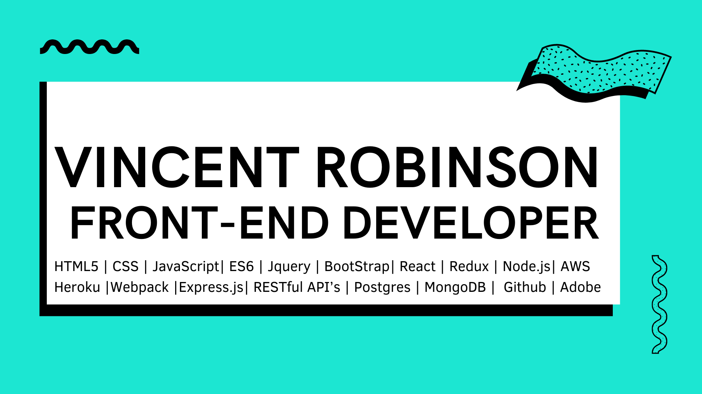

### Hey Everyone 👋🏽

I'm Vincent, a Front-end Web Dev from Atlanta, GA. Currently, i'm working on React projects and studying to recieve my amazon web devoloper certification. I've been developing for a year plus now and I have to say that I love it! Soving problems has always been a passion of mine, but this is a whole new level. I plan on continuing my education and contributing to the community through open source in anyway that I can! Feel free to start up a chat i'm always open to collaboration! 

----------------------------------

- 🔭 I’m currently working on a personal React project
- 🌱 I’m currently learning AWS
- 🤔 I’m looking for help with job opportunities 
- 💬 Ask me about Atlanta United
- 😄 Pronouns: He/Him/His
- ⚡ Fun fact: I love Soccer 

----------------------------------

### Tech Stack 💻

  
  
  
  
  
  
  
  
  
  
  
  
  
  
  

 

-------------------------------------------
### Contacts ☎️

Mobile📞    (678) 468-3222  
Email📨    vincentrobinsonjr97@gmail.com  

  

-------------------------------------------
“There are only two ways to live your life. One is as though nothing is a miracle.
  The other is as though everything is a miracle.”
― Albert Einstein
